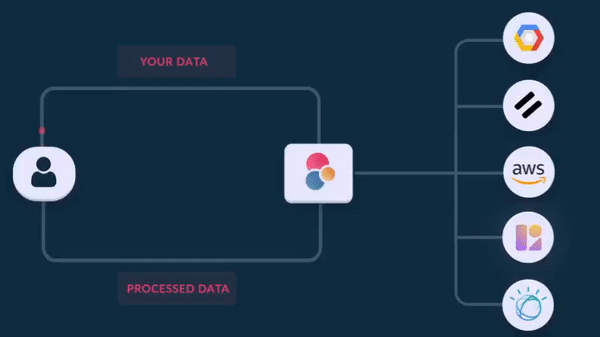

[](https://opensource.org/licenses/Apache-2.0) [](https://github.com/edenai/edenai-apis/actions/workflows/test.yml)


<!-- markdown-toc start - Don't edit this section. Run M-x markdown-toc-refresh-toc -->
**Table of Contents**

- [Eden AI APIs](#edenai-apis)
    - [Package Installation](#package-installation)
    - [Quick Start](#quick-start)
        - [Asynchronous features](#asynchronous-features)
    - [All available features and providers ⚠️](https://github.com/edenai/edenai-apis/blob/master/AVAILABLES_FEATURES_AND_PROVIDERS.md)
    - [Contribute](#contribute)
    - [Don’t want to create accounts for all providers and host the project by yourself?](#dont-want-to-create-accounts-for-all-providers-and-host-the-project-by-yourself)
    - [Join the community!](#join-the-community)
    - [License](#license)

<!-- markdown-toc end -->
# Eden AI APIs

[Eden AI](https://www.edenai.co/?referral=github) aims to simplify the use and deployment of AI technologies by providing a unique API that connects to all the best AI engines. 

With the rise of **AI as a Service** , a lot of companies provide off-the-shelf trained models that you can access directly through an API. These companies are either the tech giants (Google, Microsoft , Amazon) or other smaller, more specialized companies, and there are hundreds of them. Some of the most known are : DeepL (translation), OpenAI (text and image analysis), AssemblyAI (speech analysis). 

There are **hundreds of companies** doing that. We're regrouping the best ones **in one place** !

➡️ [Read more about it ...](https://medium.com/@samyme/a-i-trough-an-api-its-time-to-start-building-with-ai-instead-of-worrying-about-it-e915c9869228)

**why aren't you regrouping Open Source models (instead of proprietary APIs) into one repo?** : Because it doesn't make sens to deploy and maintain large pytorch (or other framework) AI models in every solution that wants AI capabilities (especially for document parsing, image and video moderation or speech recognition) . So using APIs makes way more sens. Deployed OpenSource models are being included using different APIs like HuggingFace and other equivalents.




## Package Installation

You can install the package with pip :
``` bash
pip install git+https://github.com/edenai/edenai-apis 
```

## Quick Start


To make call to different AI providers, first add the api-keys/secrets for the provider you will use in `edenai_apis.api_keys.<provider_name>_settings_templates.json`, then rename the file to `<provider_name>_settings.json`
  
When it's done you can directly start using edenai_apis.
Here is a quick example using Microsoft and IBM Keyword Extraction apis:
```python
from edenai_apis import Text

keyword_extraction = Text.keyword_extraction("microsoft")
microsoft_res = keyword_extraction(language="en", text="as simple as that")

# Provider's response
print(microsoft_res.original_response)

# Standardized version of Provider's response
print(microsoft_res.standardized_response)

for item in microsoft_res.standardized_response.items:
    print(f"keyword: {item.keyword}, importance: {item.importance}")


# What if we want to try an other provider?
ibm_kw = Text.keyword_extraction("ibm")
ibm_res = ibm_kw(language="en", text="same api & unified inputs for all providers")


# `original_response` will obviously be different and you will have to check
# the doc of each individual providers to know how to parse them
print(ibm_res.original_response)

# We can however easily parse `standardized_response`
# the same way as we did for microsoft:
for item in ibm_res.standardized_response.items:
    print(f"keyword: {item.keyword}, importance: {item.importance}")
```

### Asynchronous features

If you need to use features like _speech to text_, _object extraction_ from videos, etc. Then you will have to use asynchronous operations. This means that you will first make a call to launch an asynchronous job, it will then return a job ID allowing you to make other calls to get the job status or response if the job is finished

```python
from edenai_apis import Audio

provider = "google" # it could also be assamblyai, deepgram, microsoft ...etc
stt_launch = Audio.speech_to_text_async__launch_job(provider)
stt_get_result = Audio.speech_to_text_async__get_job_result(provider)


res = stt_launch(
    file=your_file.wav,
    language="en",
    speakers=2,
    profanity_filter=False,
)

job_id = stt_launch.provider_job_id

res = stt_get_result(provider_job_id=job_id)
print(res.status)  # "pending" | "succeeded" | "failed"
```

## Available Features & Providers
⚠️ You can find a list of all available features and providers [here](AVAILABLES_FEATURES_AND_PROVIDERS.md) ⚠️

## Contribute

We would love to have your contribution. Please follow our [guidelines for adding a new AI provider's API or a new AI feature](CONTRIBUTE.md). You can check [the package structure](PACKAGE_STRUCTURE.md) for more details on how it is organized.
We use GitHub issues for tracking requests and bugs. For broader discussions you can [join our discord](https://discord.com/invite/VYwTbMQc8u).

## Don’t want to create accounts for all providers and host the project by yourself?
You can create an account on [Eden AI](https://app.edenai.run/user/register?referral=github) and have access to all the AI technologies and providers directly through our API.
[](https://app.edenai.run/user/register?referral=github)


## Join the community!
Join our friendly community to improve your skills, focus on the integration of AI engines, get help to use Eden AI API and much more !

[](https://discord.gg/VYwTbMQc8u)
[](https://www.linkedin.com/company/edenai/) [](https://edenai.medium.com/)


## License
[Apache License 2.0](LICENSE)
